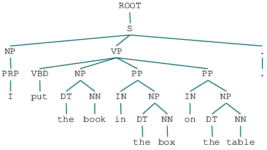
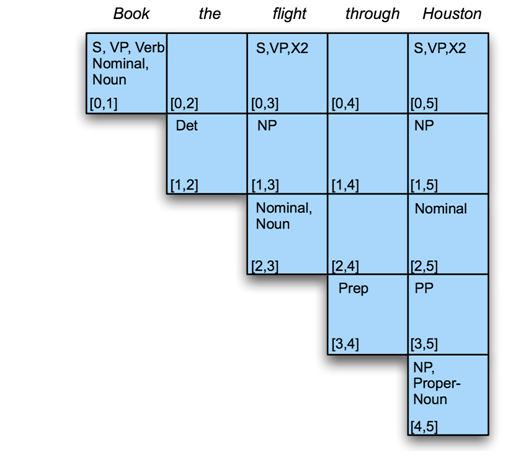
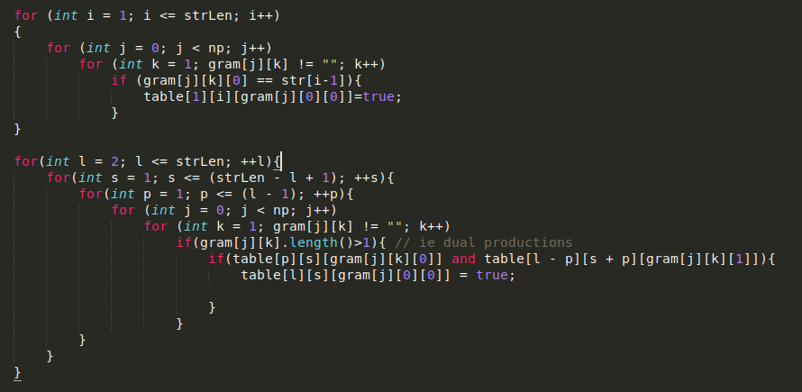
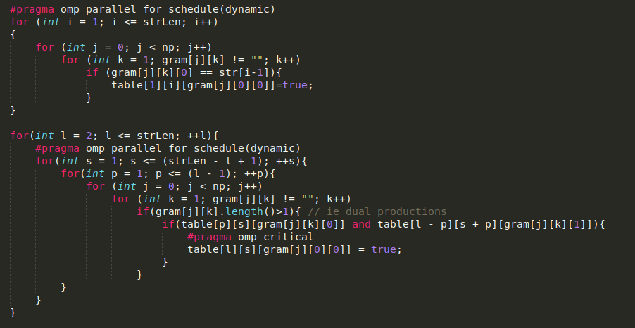
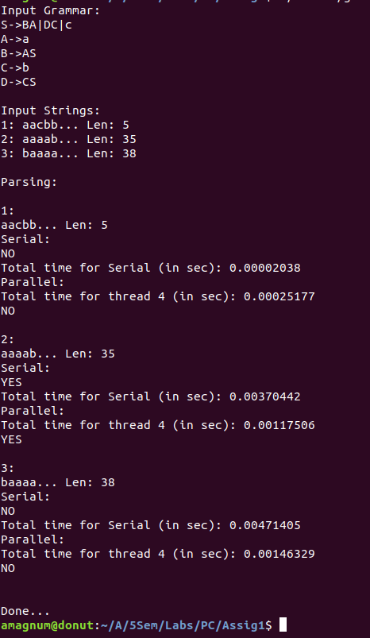
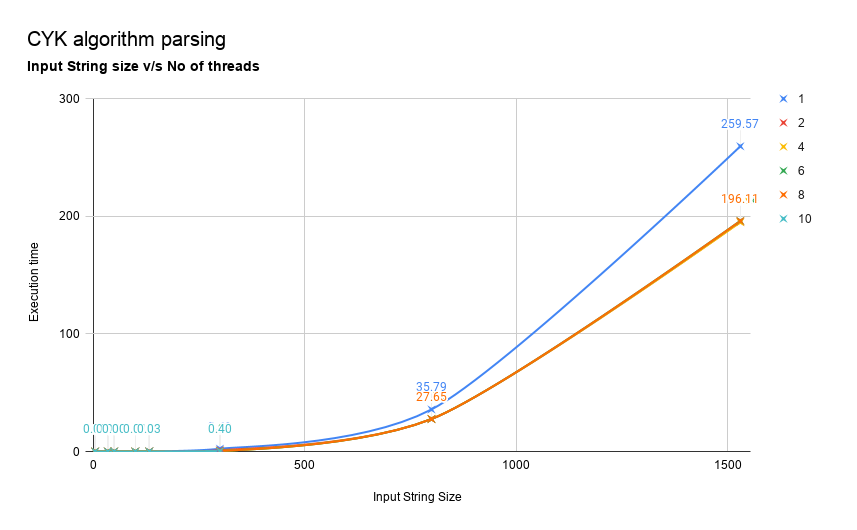
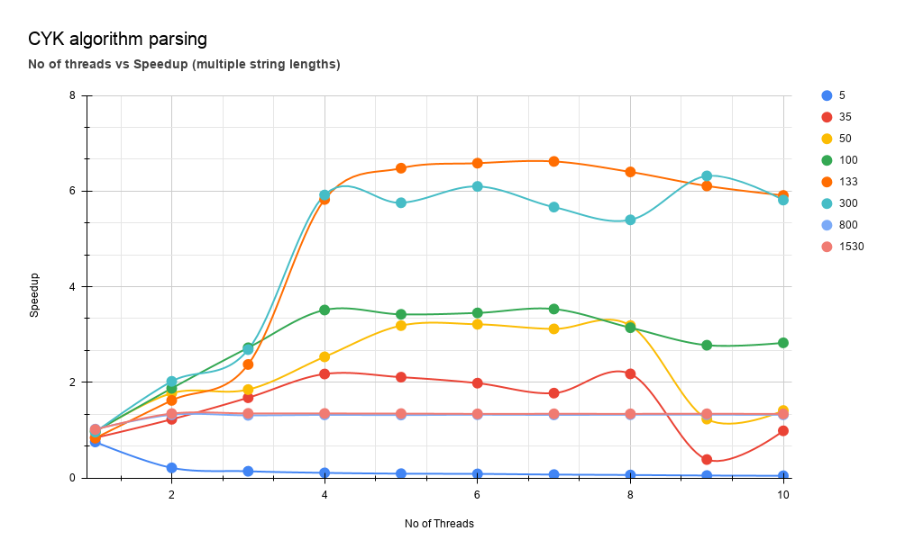
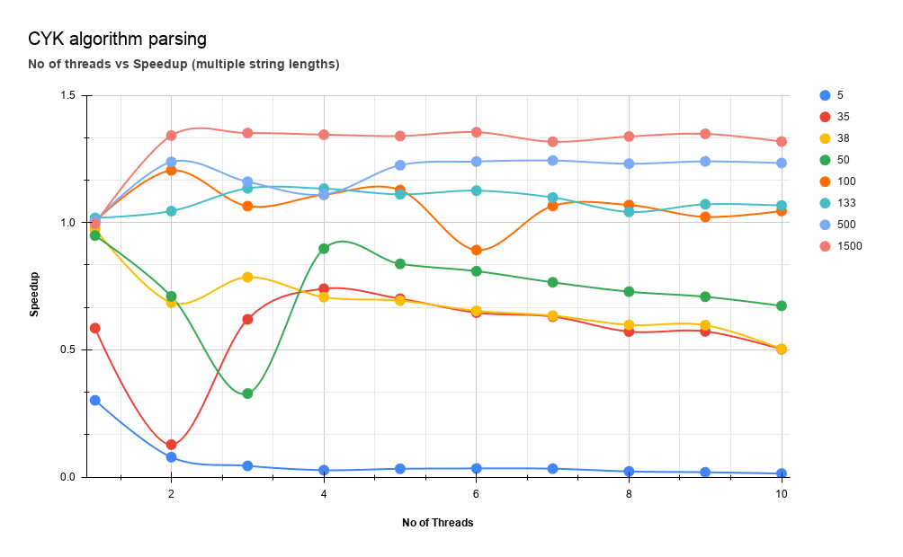
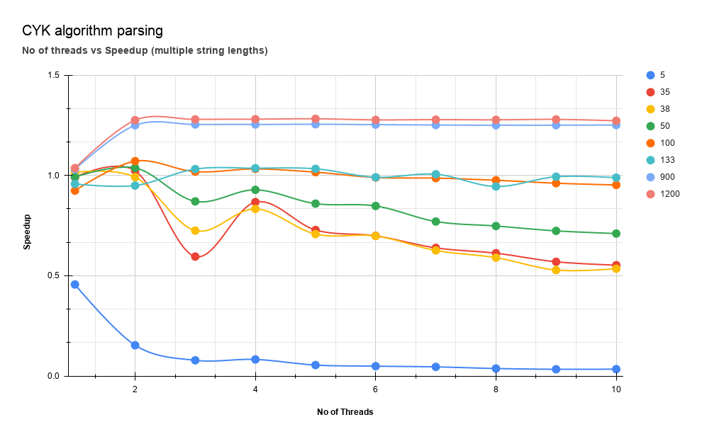

# Parallel-CYK-CFG-Parser-OMP

**Problem Statement:**

Write a parallel program to parse a string of symbols. The inputs are a context-free grammar G in Chomsky Normal Form and a string of symbols. In the end, the program should print yes if the string of symbols can be derived by the rules of the grammar and no otherwise. Write a sequential program (no OpenMP directives at all) as well. 

Compare the running time of the sequential program with the running time of the parallel program and compute the speedup for different grammars and different string lengths. (OpenMP)

### **Solution Approach:**

For deriving a string which follows certain grammar rules, which are in Chomsky-Normal Form, we can use the CYK algorithm (Cocke–Younger–Kasami algorithm).

It is straight-forward to parallelise the CYK algorithm for multi-core SMP machines using OpenMP. OpenMP programs are C++ programs with pragmas that indicate which loops should be parallelised.  The main technical challenges in parallelising the CKY algorithm are synchronising the parallel threads and ensuring that different parallel threads do not interfere with each other. This is achieved by using synchronisation constructs with implicit barriers, thread-private temporary variables and constructs that ensure that updates to shared variables occur as critical operations.

fig 1.1 (Eg. Parsing table created during CYK algorithm)

### Motivation:

Using parallel programming concepts we can divide our bigger problem into a smaller problem, and the smaller individual problem can be assigned to a single core/processor/thread, here we use OpenMP (multi threading library) to achieve parallel execution. Here we are doing **Multi-Threading**.

**Solution given by OpenMP (Multi-Threading):**

* In Multithreading, a common address space is shared by all the threads. hence we need not to replicate data to each of the other threads, the **data remains shared** among all the threads. 

* In Multithreading, **Process creation** is economical, hence it does not use much resources.

* OpenMP provides solution to handle critical section, by using **#pragma omp critical(updateData)**

**Serial Execution code for CYK Algorithm**

**Parallel execution code for CYK Algorithm**

<table>
  <tr><td> <b>How to run?</b> </td> </tr>
  <tr><td>
$ g++ -fopenmp main.cpp -o main
	</td> </tr>
<tr>
    <td>
$ ./main ./gram1.in < input1.in
</td> </tr>
	
<tr>
    <td>

Notes: 
Create one file gram1.in which contains the grammar, eg: 

S->AC|AB 

C->SB 

A->a 

B->b 

Create another file input.in which contains all the strings.

	3

	aacbb

	aaaabaaaaaabbbbbbcbbbbbbaaaaaabaaaa

	baaaabaaaaaabbbbbbccbbbbbbaaaaaabaaaab

	</td>
  </tr>
</table>

## Testing for sample Input (Correctness):

Given CFG (for easier understanding): 

S -> aSa | bSb | c

CNF of above grammar (Input to the Program)

S -> BA | DC | c

A -> a

B -> AS

C -> b 

D -> CS

Sample Input 1:

aaaabaaaaaabbbbbbcbbbbbbaaaaaabaaaa

Expected Output 1:

Yes

Sample Input 2:

baaaabaaaaaabbbbbbccbbbbbbaaaaaabaaaab

Expected Output 1:

No

**Program output:**

### 

### **Results:**

	

Comparing the running time of the sequential program with the running time of the parallel program and computing the speedup for different grammars and different string lengths.

The execution time of the problem decreases with increasing the no. of threads, however after increasing the treads count by a certain number of threads, there is no significant improvement in execution time.

**Program run Time** v/s **No of threads** 

Fig: General execution pattern (for all grammars)

#### **Speedup comparisons:**

Comparing speedup vs no. of threads for different sizes of data. For large datasets parallel computing usually performs better.

<table>
  <tr>
    <td>Grammar 1
S->BA|DC|c
A->a
B->AS
C->b 
D->CS</td>
    <td>Grammar 2
S->AC|AB
C->SB
A->a
B->b
</td>
    <td>Grammar 3
S->a|XA|AX|b
A->RB
B->AX|b|a
X->a
R->XB
</td>
  </tr>
</table>

String Size ->

<table>
  <tr>
    <td>No of Threads</td>
    <td>5</td>
    <td>35</td>
    <td>38</td>
    <td>50</td>
    <td>100</td>
    <td>133</td>
    <td>900</td>
    <td>1200</td>
    <td>600</td>
  </tr>
  <tr>
    <td>1</td>
    <td>0.45640666</td>
    <td>0.9907694</td>
    <td>1.01579957</td>
    <td>0.99248479</td>
    <td>0.92442636</td>
    <td>0.95771403</td>
    <td>1.03116725</td>
    <td>1.0370501</td>
    <td>1.03671726</td>
  </tr>
  <tr>
    <td>2</td>
    <td>0.1534068</td>
    <td>1.0239146</td>
    <td>0.99169445</td>
    <td>1.03813392</td>
    <td>1.07155521</td>
    <td>0.94979691</td>
    <td>1.25034979</td>
    <td>1.27576512</td>
    <td>1.24965535</td>
  </tr>
  <tr>
    <td>3</td>
    <td>0.07835094</td>
    <td>0.59557128</td>
    <td>0.72511692</td>
    <td>0.87092211</td>
    <td>1.01903621</td>
    <td>1.0319756</td>
    <td>1.25444677</td>
    <td>1.2797407</td>
    <td>1.24452983</td>
  </tr>
  <tr>
    <td>4</td>
    <td>0.08268294</td>
    <td>0.86761364</td>
    <td>0.83336513</td>
    <td>0.92842474</td>
    <td>1.03267406</td>
    <td>1.03629382</td>
    <td>1.25441626</td>
    <td>1.28088945</td>
    <td>1.24374479</td>
  </tr>
  <tr>
    <td>5</td>
    <td>0.05463936</td>
    <td>0.72818829</td>
    <td>0.70765348</td>
    <td>0.85970993</td>
    <td>1.01655306</td>
    <td>1.03336775</td>
    <td>1.25545664</td>
    <td>1.28282309</td>
    <td>1.24139685</td>
  </tr>
  <tr>
    <td>6</td>
    <td>0.0492262</td>
    <td>0.69891668</td>
    <td>0.69836049</td>
    <td>0.84802304</td>
    <td>0.98992425</td>
    <td>0.99108947</td>
    <td>1.25371</td>
    <td>1.27728143</td>
    <td>1.24207788</td>
  </tr>
  <tr>
    <td>7</td>
    <td>0.04561572</td>
    <td>0.63906515</td>
    <td>0.62621847</td>
    <td>0.77049791</td>
    <td>0.98685954</td>
    <td>1.0062568</td>
    <td>1.25170224</td>
    <td>1.27855614</td>
    <td>1.2414088</td>
  </tr>
  <tr>
    <td>8</td>
    <td>0.03747077</td>
    <td>0.61240706</td>
    <td>0.59025122</td>
    <td>0.74798595</td>
    <td>0.97621128</td>
    <td>0.9450912</td>
    <td>1.25042621</td>
    <td>1.27762688</td>
    <td>1.23824785</td>
  </tr>
  <tr>
    <td>9</td>
    <td>0.03370913</td>
    <td>0.56964707</td>
    <td>0.52830135</td>
    <td>0.72378545</td>
    <td>0.96146722</td>
    <td>0.9939444</td>
    <td>1.25078515</td>
    <td>1.27982125</td>
    <td>1.2397764</td>
  </tr>
  <tr>
    <td>10</td>
    <td>0.03432386</td>
    <td>0.55278812</td>
    <td>0.53512065</td>
    <td>0.71054016</td>
    <td>0.95268262</td>
    <td>0.98908832</td>
    <td>1.25151823</td>
    <td>1.27283151</td>
    <td>1.23697332</td>
  </tr>
</table>

fig: Speedup table for grammar 3

**Fig: Grammar 1**

**Fig: Grammar 2**

**Fig: Grammar 3**

## REFERENCES
1. Dr. Chandresh Kumar Maurya, Assisant professor, IIT Indore [link](https://chandu8542.github.io/)
